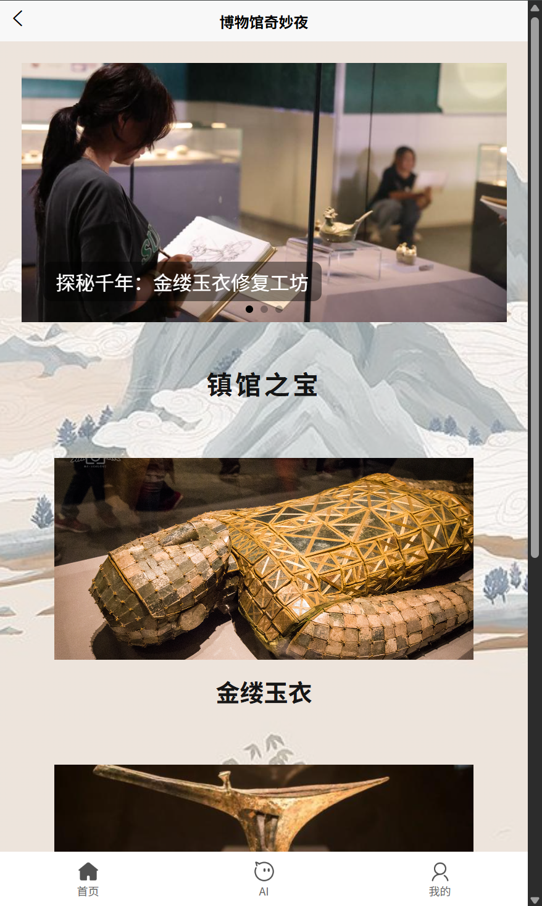
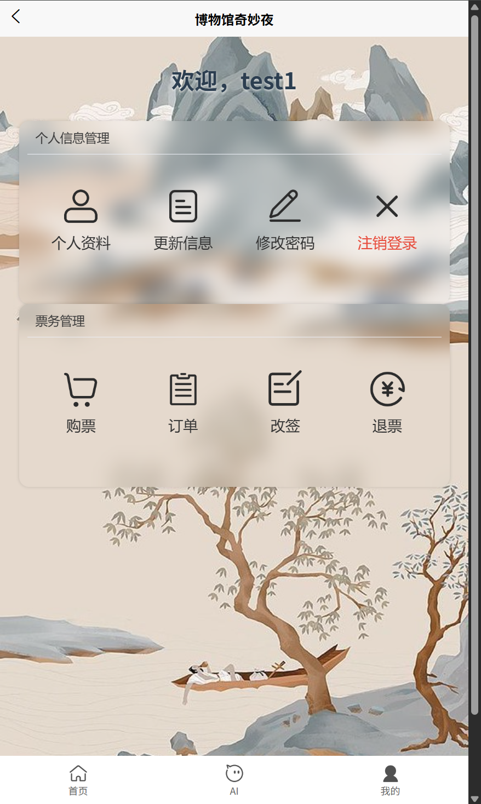
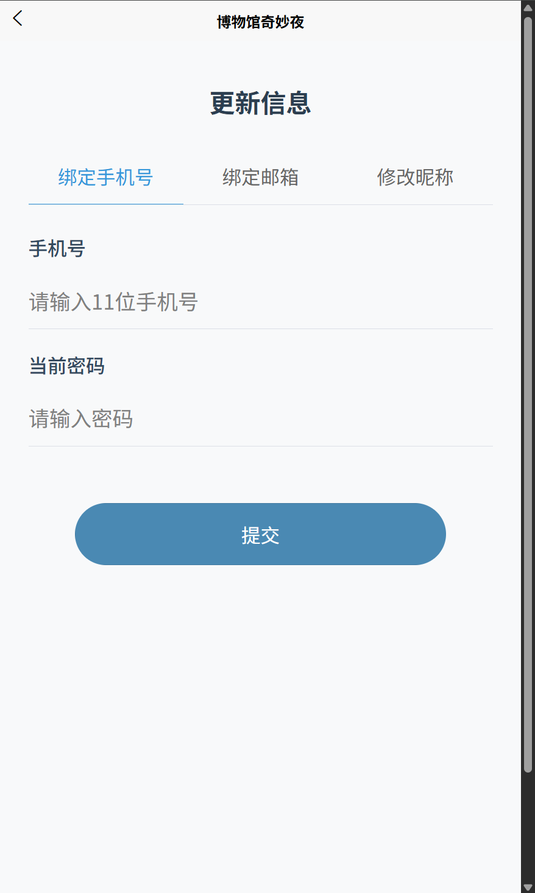
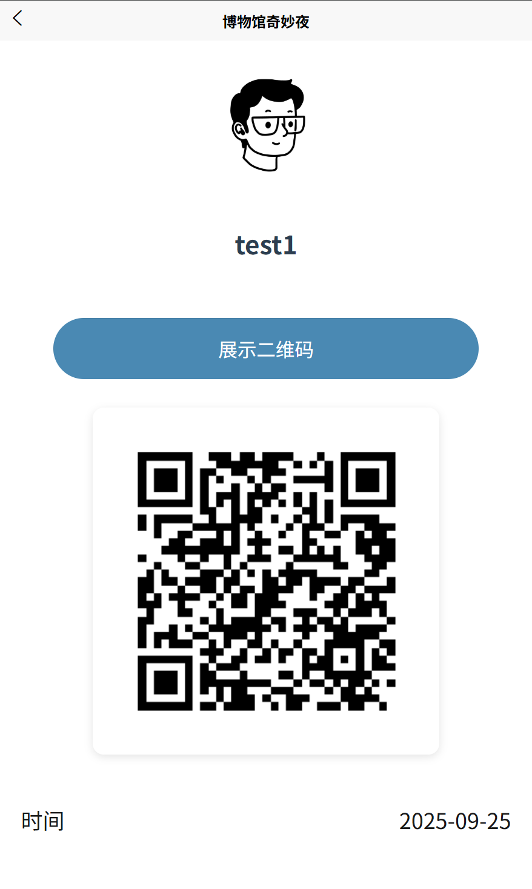
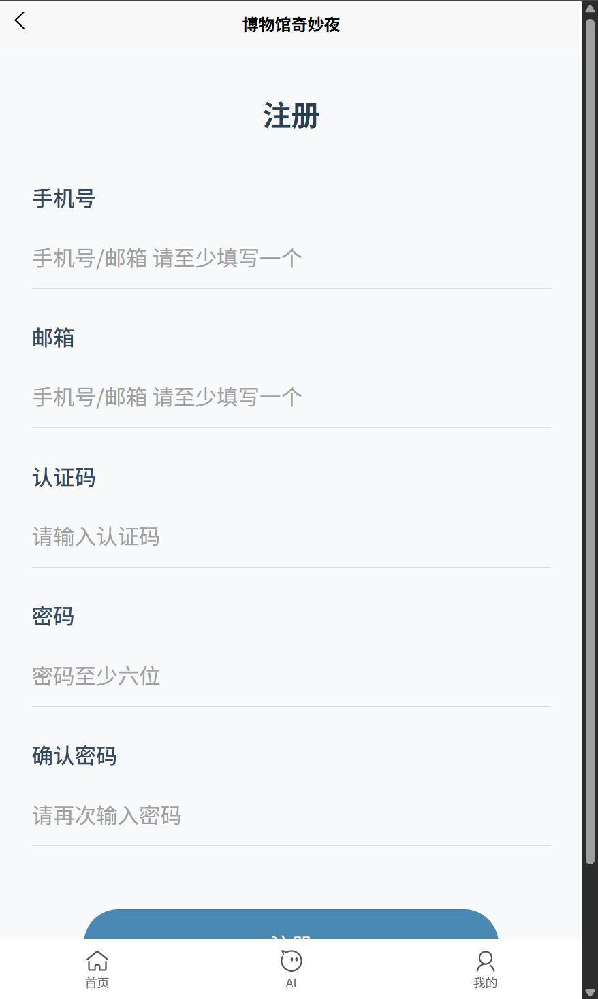
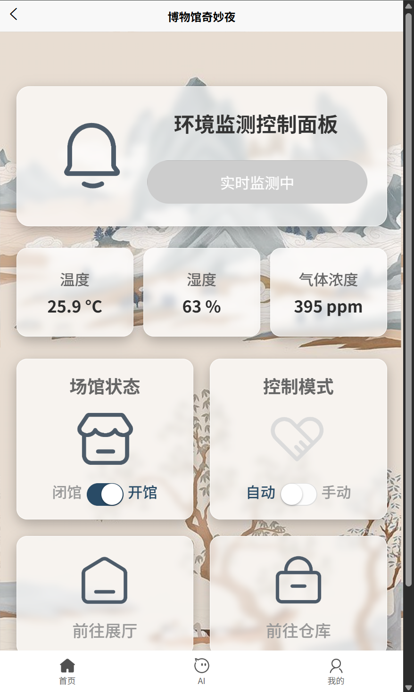
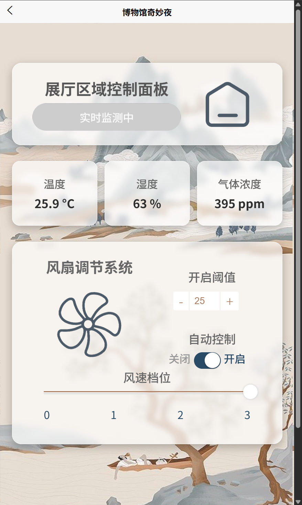

# 智慧博物馆后端系统

## 项目简介

智慧博物馆后端系统是一个基于 Go 语言开发的现代化博物馆管理平台，集成了物联网、人工智能、数字化票务等多种技术，为博物馆提供智能化的环境监控、设备控制、用户管理和票务服务。

## 🌟 主要特性

### 核心功能
- **用户管理系统**：支持用户注册、登录、权限管理，专家用户需激活码验证
- **环境监控**：实时监控博物馆各房间的温度、湿度、光照、气体等环境数据
- **智能设备控制**：通过 MQTT 协议控制风扇、灯光等设备，支持手动和 AI 自动控制
- **数字化票务**：二维码票务生成、验证、统计，支持自动化入馆管理
- **AI 智能助手**：集成 MaxKB，提供智能问答和设备控制建议
- **数据统计分析**：每日入馆人数统计、环境数据分析

### 技术亮点
- **分层架构设计**：清晰的 MVC 架构，便于维护和扩展
- **动态房间管理**：通过配置文件实现房间数量的灵活扩展
- **高并发优化**：Redis 缓存 + 原子操作保证数据一致性
- **物联网集成**：MQTT 协议实现设备实时通信
- **安全认证**：JWT + 邮箱验证码 + 激活码多重安全保障

## 实践展示












## 🏗️ 系统架构

```
├── controller/          # 控制器层 - 处理 HTTP 请求
├── service/            # 服务层 - 业务逻辑处理
├── dao/                # 数据访问层 - 数据库操作
├── model/              # 数据模型 - 结构体定义
├── middleware/         # 中间件 - JWT 认证等
├── my_init/           # 初始化模块 - 系统启动配置
├── config/            # 配置管理
├── test/              # 测试用例
└── qrcodes/           # 二维码存储目录
```

## 🚀 快速开始

### 环境要求

- Go 1.24.5+
- MySQL 8.0+
- Redis 6.0+
- MQTT Broker (推荐 EMQX)

### 安装依赖

```bash
go mod tidy
```

### 配置文件

自行填充 `config/config.yaml`


### 运行项目

```bash
go run main.go
```

服务将在 `http://localhost:8080` 启动

## 🔧 关键技术实现

### 1. 高并发数据一致性

项目使用 Redis 原子操作处理高频数据，如每日入馆统计：

```go
// 原子性增加入馆人数
RedisClient.Incr(context, config.TOTAL_NUM)

// 定时任务同步到 MySQL
func StartDailyEntryCountJob() {
    c := cron.New()
    c.AddFunc("0 0 * * *", func() {
        count, _ := service.RedisClient.Get(ctx, config.TOTAL_NUM).Int()
        dao.InsertNewDailyEntryCount(count)
        service.RedisClient.Set(ctx, config.TOTAL_NUM, 0, 0)
    })
    c.Start()
}
```

### 2. 动态房间管理

通过配置文件实现房间的动态扩展：

```go
// 配置解析
type AppConfig struct {
    RoomMapping map[string]string `mapstructure:"room_mapping"`
}

// 动态表名
func (Environment) TableName(roomName string) string {
    return config.AppConfigInstance.RoomMapping[roomName]
}
```

### 3. MQTT 物联网集成

```go
// 订阅环境数据
func CollectDataFromHardware(topic string) {
    service.SubscribeMQTT(topic, func(client MQTT.Client, msg MQTT.Message) {
        var data EnvironmentData
        json.Unmarshal(msg.Payload(), &data)
        // 处理环境数据并存储
        controller.CreateEnvironmentByRoom(data.Room, &env)
    })
}
```

### 4. JWT 安全认证

```go
// JWT 中间件
func JWTAuthMiddleware() gin.HandlerFunc {
    return func(c *gin.Context) {
        authHeader := c.GetHeader("Authorization")
        if !strings.HasPrefix(authHeader, "Bearer ") {
            c.JSON(401, gin.H{"error": "未携带token"})
            c.Abort()
            return
        }
        // 验证 token
        token, err := jwt.Parse(tokenString, func(token *jwt.Token) (interface{}, error) {
            return jwtKey, nil
        })
        if err != nil || !token.Valid {
            c.JSON(401, gin.H{"error": "token无效"})
            c.Abort()
            return
        }
        c.Next()
    }
}
```

## 📊 项目难点与解决方案

### 1. 多房间动态扩展
**难点**：不同博物馆房间数量不同，需要支持灵活配置
**解决**：通过配置文件映射 + 动态表结构，实现零代码修改的房间扩展

### 2. 高并发数据一致性
**难点**：入馆统计等高频操作容易出现数据不一致
**解决**：Redis 原子操作 + 定时同步，保证性能和一致性

### 3. 硬件与 AI 集成
**难点**：物联网设备控制 + AI 智能决策的技术融合
**解决**：MQTT 协议 + MaxKB AI 接口，实现硬件智能化控制

### 4. 安全认证体系
**难点**：多角色权限管理 + 防刷验证
**解决**：JWT + 邮箱验证码 + 激活码多重验证


## 📧 联系方式

- 项目地址：[https://github.com/xiuivfbc/backend_of_smart_museum](https://github.com/xiuivfbc/backend_of_smart_museum)
- 作者：xiuivfbc